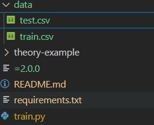

# Session 5
Implement a Deep Learning App. Train a model to classify text reviews between positive and negative and deploy a web app to predict on user reviews. 
Then, deploy the model using Google Cloud App Engine.

## Installation
### With Conda
Create a conda environment by running
```
conda create --name aidl-session5 python=3.8
```
Then, activate the environment
```
conda activate aidl-session5
```
and install the dependencies
```
pip install -r requirements.txt
```

## Running the project
To train the model run:
```
python session-5/train.py
```

To run the app run:
```
python session-5/app/main.py
```
then, you can test you app by going to http://localhost:8080

## Errors to be fixed
1. Requirements.txt
2. Installation of portalocker for the torchdata library in the train.py level
```
conda install -c conda-forge portalocker>=2.0.0
```
3. Google Drive link, it is needed to download the dataset
````
 tar -xzvf yelp_review_polarity_csv.tar.gz
````
4. Move the datatse result of train.csv and test.csv under a data folder to the root of the project at the train.py's level

5. Adapt the utils